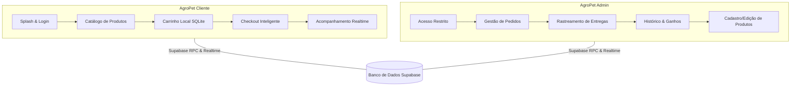

  

<h1 align="center">
  
</h1>

---

# 🐾 AgroPet Lambari — E-Commerce Mobile Multi-App

Seja muito bem-vindo ao repositório do **AgroPet Lambari**, um ecossistema mobile avançado composto por **dois aplicativos isolados** (Cliente e Administrador) desenvolvidos com as melhores práticas de Engenharia de Software, arquitetura robusta e banco de dados de alto desempenho.

---

## 👨‍💻 Sobre o Desenvolvedor

Olá, Leitor! Meu nome é **Caio Magalhães**, tenho 21 anos e sou graduando em **Sistemas de Informação** no **CEFET-MG** (*Centro Federal de Educação Tecnológica de Minas Gerais*). Como um jovem desenvolvedor apaixonado por arquitetura de software, interfaces imersivas e desempenho mobile, o **AgroPet Lambari** representa o meu primeiro grande marco prático na consolidação de conceitos avançados como transações de banco de dados ACID, desenvolvimento de APIs robustas em tempo real, sincronização offline tolerante a falhas e separação estrita de privilégios.

Este projeto reflete minha dedicação em criar softwares que não apenas resolvam problemas práticos com excelência comercial, mas que também sigam padrões limpos de design, facilitando a manutenção e a escalabilidade técnica.

---

## 💡 Motivação e Características

O **AgroPet Lambari** é um projeto nascido de uma necessidade real de mercado: modernizar a gestão de vendas e o canal de atendimento de uma loja especializada em agropecuária e petshop na histórica cidade de **Lambari, MG**.

### 🌟 Destaques de Negócio
- **Público de Lambari e Região:** Os moradores podem adquirir rações, ferramentas e insumos com entrega ágil em domicílio.
- **Logística Integrada com Raio de 17km:** O aplicativo calcula dinamicamente a geolocalização do cliente. Clientes dentro de um raio de 17km do centro de Lambari podem usufruir da entrega rápida da loja.
- **Integração Externa (Mercado Livre):** Clientes localizados fora do raio limite de entrega da loja física são redirecionados automaticamente para anúncios do estabelecimento no **Mercado Livre**, expandindo a cobertura de vendas sem onerar a logística local.

---

## 🛠 Tech Stack

<table align="center">
   <tr>
      <td align="center">
         
          TypeScript
      </td>
      <td align="center">
         
          React Native
      </td>
      <td align="center">
         
          Expo
      </td>
   </tr>
   <tr>
      <td align="center">
         
          Supabase
      </td>
      <td align="center">
         
          SQLite
      </td>
      <td align="center">
         
          PostgreSQL
      </td>
   </tr>
   <tr>
      <td align="center">
         
          HTML5
      </td>
      <td align="center">
         
          CSS3
      </td>
      <td align="center">
         
          JavaScript
      </td>
   </tr>
</table>

---

## 📱 Estrutura do Ecossistema (Cliente vs Admin)

Para garantir máxima segurança operacional e separação estrita de escopo, o projeto compila **dois APKs totalmente distintos**, impedindo que vulnerabilidades no código do app de e-commerce possam expor dados de faturamento gerenciais da loja.

### 🛍️ AgroPet Cliente (13 Telas)
O aplicativo do cliente foi desenhado com foco em conversão, UX de alta fluidez e resiliência a quedas de conexão:
- **Splash Screen Dinâmico:** Carregamento de marca com verificação assíncrona de sessão.
- **Acesso Integrado (Supabase Auth):** Fluxo de login e cadastro seguro de clientes.
- **Catálogo de Alta Performance:** Filtros rápidos, busca integrada e exibição de detalhes detalhados.
- **Carrinho Local (SQLite):** Persistência robusta que mantém as compras do cliente seguras mesmo com o aplicativo fechado ou em locais com falha de sinal de rede.
- **Checkout Dinâmico:** Opções para pagamento no ato da entrega (PIX, Cartão de Crédito/Débito e Dinheiro).
- **Acompanhar Pedido:** Uma timeline responsiva que exibe o status de envio em tempo real com dados da entrega.
- **Mapa e Geolocalização:** Visualização de rotas, endereços salvos e rastreamento ativo de entregadores.

### 🛡️ AgroPet Admin (10 Telas)
O centro operacional do lojista, focado na gestão rápida do estoque, processamento de pedidos e relatórios de receita:
- **Login Autenticado por Permissão (Role):** Segurança robusta bloqueando acessos não autorizados.
- **Painel de Controle Principal (Hub):** Atalhos rápidos para operações essenciais.
- **Mapa de Logística de Entrega:** Visualização das entregas em andamento e cadastro manual de coordenadas de concorrentes regionais para fins estratégicos.
- **Gerenciador de Pedidos Avançado:** Atualização em tempo real do status das encomendas.
- **Cadastro e Edição de Produtos:** Formulários dinâmicos com upload de imagens e gerenciamento de estoque integrado.

---

## 🛠️ Como o Projeto Funciona (Arquitetura Técnica)

O **AgroPet Lambari** adota conceitos de **Clean Architecture** e **DDD (Domain-Driven Design)**, promovendo baixo acoplamento e altíssima testabilidade. Três grandes pilares de engenharia se destacam no seu funcionamento interno:

### 1. Offline-First com Cache Síncrono (SQLite + Supabase)
A fim de contornar os problemas comuns de internet oscilante no interior de Minas Gerais, o aplicativo implementa uma estratégia robusta baseada em **SQLite (`expo-sqlite`)** para armazenar o catálogo de produtos de forma local. Desta forma:
- O catálogo de produtos é cacheado localmente e carregado instantaneamente.
- O carrinho de compras é totalmente operado offline, sincronizando seus dados de forma transacional e transparente com o **Supabase** apenas no momento da consolidação final do pedido.

### 2. Validação Atômica de Estoque no Checkout (Prevenção de Corrida)
Para solucionar o clássico problema concorrente de múltiplos clientes comprando o mesmo item físico de estoque reduzido ao mesmo tempo, a consolidação de compras é processada na camada de banco de dados do **Supabase** através de uma **Função RPC (`finalizar_pedido`)** escrita em PL/pgSQL:
- O sistema executa instruções `SELECT ... FOR UPDATE` travando as linhas dos respectivos produtos durante a transação.
- **Garantia ACID:** Caso o estoque total seja decrementado a zero antes de uma das solicitações, a transação correspondente sofre rollback e o app exibe uma mensagem de erro amigável.
- **Trigger de Auto-Desativação:** Um gatilho automático (`auto_deactivate_product`) desativa instantaneamente a exibição do produto no catálogo do cliente quando o estoque atinge zero, reativando-o assim que o estoque for reposto pelo administrador.

### 3. Rastreamento e Sincronização GPS em Tempo Real
A arquitetura de rastreamento do entregador utiliza a capacidade reativa do **Supabase Realtime**:
- O dispositivo do entregador (App Admin), sob permissões nativas de geolocalização (`expo-location` operando em segundo plano), grava dados na tabela transacional `delivery_tracking` em intervalos periódicos.
- O aplicativo cliente assina esse canal e recebe as coordenadas via WebSockets.
- Para evitar a sensação de "saltos" do carro no mapa decorrentes de oscilações de sinal, o app do cliente implementa técnicas de **interpolação e suavização gráfica** no componente de mapa (`react-native-maps`), entregando ao usuário final um rastreamento limpo e com deslizar contínuo.

---

## 🚀 Funcionalidades Futuras (Backlog de Inovação)

Novas e inovadoras mecânicas de comportamento visual e de negócios estão catalogadas para implementação nas próximas versões:

- **Pagamento Nativo por PIX:** Geração inteligente de QR Code *Copy and Paste* dinâmico com suporte para leitor via câmera no app do cliente.
- **Autenticação Biométrica:** Acesso facilitado e seguro ao painel administrativo por meio de FaceID ou impressão digital local (`expo-local-authentication`).

---

## 🕹️ Histórico de Updates Realizados (Sprint de Inovação)

Compilamos abaixo a lista completa de mecânicas de ponta que foram totalmente implementadas e agregadas ao ecossistema do **AgroPet Lambari**:

### 🚚 1. Sistema de Desativação Dinâmica de Frete
*   **Controle Centralizado (Admin):** O lojista pode interromper temporariamente todas as entregas por meio de um switch reativo em seu painel administrativo.
*   **Comportamento Reativo (Cliente):** O aplicativo do cliente captura instantaneamente a desativação por WebSockets do Supabase, ocultando a aba de mapas e exibindo um aviso permanente em vermelho no catálogo. Além disso, o carrinho é ativamente bloqueado contra compras com mensagem explicativa e temporária.
*   **Reativação Premiada:** Ao reativar o frete, o cliente é recebido com uma barra de saudações azul comemorativa e o mapa retorna à barra de navegação principal de imediato.

### 🗺️ 2. Visualização de Mapa Expandido (Tela Cheia)
*   **Foco e Imersão:** Durante a entrega ativa, o rastreamento expande o mapa para tela cheia, ocultando barras de navegação superior e inferior para máxima clareza da rota do motorista.
*   **Controle de Retorno Customizado:** Um botão posicionado de forma absoluta no canto inferior esquerdo permite voltar com facilidade:
    *   **Tema Claro:** Botão azul marinho escuro com seta e texto brancos.
    *   **Tema Escuro:** Botão *soft dark* com seta e texto no amarelo ouro institucional da marca.

### ⏰ 3. Mensagens e Saudações Customizadas com Inteligência de Funcionamento
*   **Saudação Dinâmica por Nome:** Busca do banco de dados do Supabase o primeiro nome do usuário ativo (cliente ou administrador) e o saúda conforme o horário local (Bom dia/Boa noite) com focus-sincronização reativa.
*   **Biblioteca de Horários com Algoritmo Feriados:** Criamos um motor de cálculo astronômico que determina feriados nacionais móveis no Brasil (Carnaval, Páscoa, Corpus Christi) e fixos.
*   **Contador Regressivo Inteligente:** Exibição em tempo real (atualizada segundo a segundo) do tempo restante de expediente, mostrando campo de dias para inatividades maiores de 24h (fins de semana).
*   **Barra de Saudação Descartável e Persistente:** O card pode ser fechado no botão `X` da home (executando animação de rotação 180º, escala de 1 a 0 e fadeout completo), sincronizando seu estado via `SecureStore` (chave `'show_greeting_bar'`) com um toggle switch nas Configurações com animação de entrada fade/scale premium.

### 📊 4. Seleção de Datas para Consulta de Ganhos
*   **Duplo Modo de Filtragem:** O administrador pode somar faturamento e auditar despesas por **Dia Único** ou **Período Personalizado**.
*   **In-Modal Date Picker Dashboard:** Painel inovador contendo duas linhas interativas de Início e Fim que abrem os pickers de forma independente, evitando overlaps e travamentos.
*   **Validação de Domingo/Feriados com Reversão Automática:** Se o admin selecionar um dia em que a loja esteve inativa, o app exibe uma tela branca informativa e reverte de forma automática e silenciosa a seleção para o último intervalo válido anterior.

### 🎛️ 5. Painel de Vendas / Caixa e Sangria
*   **Saldo Permanente Global:** O card de Caixa no topo atua de forma separada dos filtros do dashboard, acumulando todo o faturamento transacional e debitando todas as retiradas desde o início do aplicativo.
*   **Caixa com Gaveta Negativa:** As sangrias (despesas da loja) podem levar a gaveta de dinheiro físico ao negativo. Quando isso ocorre, o saldo do caixa e a bolinha do pulsar ativo de caixa mudam dinamicamente para **Vermelho Claro** (`#FF5252`), sinalizando déficit.
*   **Máscara de Valor Reativa:** O modal de sangria possui input numérico inteligente com máscara em tempo real em R$, persistido de forma segura via `SecureStore`.
*   **Gráfico SVG Dinâmico Verde Água:** Desenho completo e responsivo de curvas suavizadas (Bezier) usando `<Svg>` com preenchimento degradê **Verde Água** (`#00BFA5`).
*   **Métricas Segmentadas:** Ticket Médio customizado em verde registry (`#339914`) e Qtd. Pedidos em Verde Água (`#00BFA5`) no claro e marfim (`#FFE082`) no escuro.

---

## 🤝 Agradecimento

Muito obrigado por dedicar seu tempo para conhecer o meu projeto **AgroPet Lambari**! Este repositório reflete horas de estudo, refatoração de código e amor pelo desenvolvimento de software de alta fidelidade técnica. Fique à vontade para explorar os arquivos do repositório, propor melhorias no código ou entrar em contato para trocarmos experiências sobre Engenharia de Software e Tecnologias Mobile.

---

## 📞 Contato & Redes Sociais

Caso queira acompanhar minha jornada de desenvolvimento de perto, ver novidades sobre projetos ou discutir parcerias profissionais:

<!-- Modern social links utilizing GitHub badges style -->

---

  © 2026 Caio Magalhães. Todos os direitos reservados. Projetado e construído com 💻, 🧠 e ☕ em Varginha, MG.

