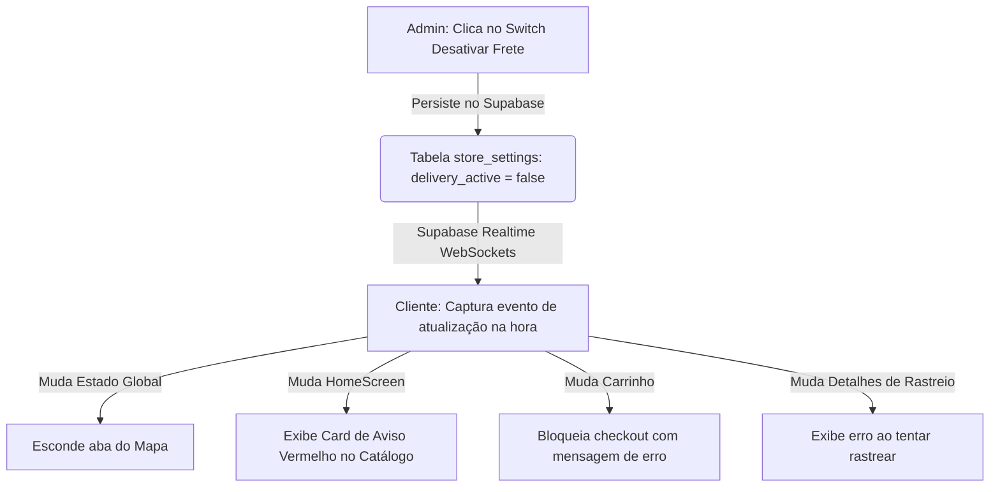
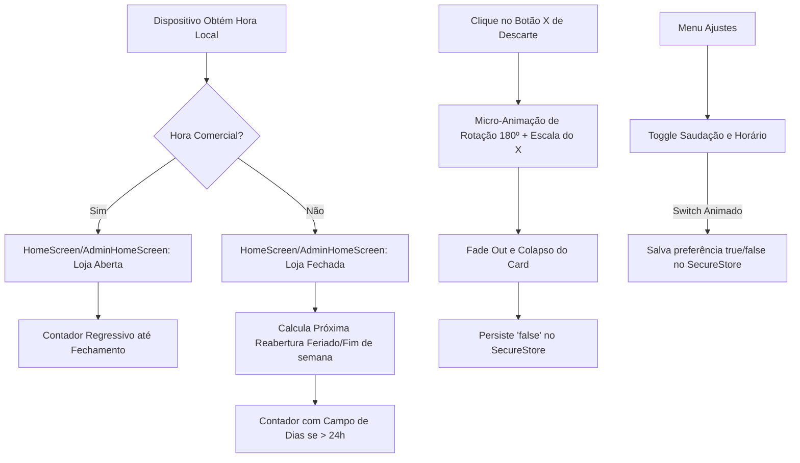
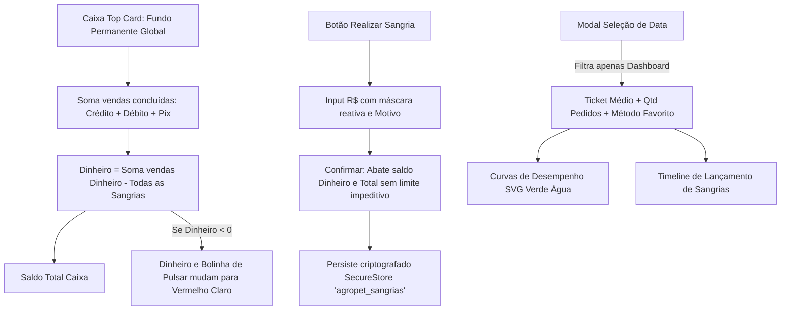

<div align="center">
  <h2>🎉 Relatório de Funcionalidades Concluídas 🎉</h2>
  <h3>🚀 Antecipação de Recursos Especiais do Backlog de Inovação</h3>
  
  <p>Este relatório reúne e documenta com riqueza de detalhes as mecânicas avançadas que foram planejadas como <b>Funcionalidades Futuras (Backlog)</b> na especificação técnica original, mas que foram <b>antecipadas com sucesso absoluto</b> e integradas à versão corrente do projeto <b>AgroPet Lambari</b>.</p>
</div>

<div align="center">

[]()
[]()
[]()
[]()

</div>

---

## 🛠️ O que foi Desenvolvido e Concluído?

Cinco das mecânicas mais complexas do backlog de inovação foram totalmente implementadas, integrando de forma reativa a base de dados do **Supabase** e o armazenamento seguro aos fluxos visuais do **Cliente** e do **Administrador**:

1. **Desativação Dinâmica do Frete (Controle Total do Admin)**
2. **Visualização de Mapa Expandido em Tela Cheia ao Rastrear**
3. **Saudações Dinâmicas e Gestão de Funcionamento em Tempo Real**
4. **Relatório e Filtro Inteligente de Ganhos (Painel Admin)**
5. **Painel de Vendas / Dashboard Administrativo com Caixa e Sangria**

Abaixo, detalhamos o funcionamento, o impacto em cada aplicativo e os diferenciais de UI/UX dessas entregas.

---

## 🚚 1. Desativação Dinâmica do Frete

Permite ao administrador desativar temporariamente os serviços de entrega local por motivo de manutenção no veículo de entregas ou força maior. A reatividade do aplicativo adapta todo o comportamento do aplicativo cliente de forma instantânea.

<div align="center">
  <kbd><b>🎛️ Fluxo de Controle de Frete</b></kbd>
</div>



### 🔴 Comportamento no App do Cliente (Frete Inativo):
- **Ocultação do Mapa:** O ícone e a tela de mapa desaparecem do menu de navegação inferior (ClientTabs), deixando apenas três ícones principais (*Início*, *Carrinho* e *Configurações*).
- **Banner de Alerta Persistente:** No topo da tela inicial de catálogo (`HomeScreen.tsx`), um card vermelho claro altamente visível adverte:
  > **Aviso:** O frete encontra-se desativado no momento. Nesse período, você não conseguirá ver o mapa, rastrear pedido e nem prosseguir com a compra, mas você pode salvar suas compras no carrinho até ele voltar. Obrigado pela compreensão. Voltaremos em breve!
- **Bloqueio no Checkout:** Ao tentar fechar um pedido na tela do carrinho, o botão de finalização é desabilitado, exibindo a mensagem: *"Não é possível prosseguir com a compra. O frete encontra-se inativo no momento."*
- **Bloqueio de Rastreio:** Ao tentar visualizar o rastreamento de qualquer pedido anterior, o aplicativo exibe o aviso impeditivo: *"Não é possível Rastrear o pedido no momento pois o frete encontra-se inativo"*.
- **Atualização de Endereço Inteligente:** No perfil, se o usuário preencher/atualizar seu endereço, os dados são salvos no SQLite e Supabase com sucesso, mas o app o conforta com um aviso personalizado:
  > *"Suas informações foram registradas com sucesso! Porém não é possível registrar sua localização no mapa pois o frete encontra-se inativo no momento. Quando voltarmos da manutenção do veículo, você já terá todas as funcionalidades do mapa ativo. Não se preocupe! Voltaremos em breve!"*

### 🟢 Reativação do Frete (O Retorno das Atividades):
Assim que o administrador reativa o frete na tela de configurações administrativas:
- O mapa do cliente é **restaurado instantaneamente** na navegação.
- Todas as restrições de carrinho, rastreio e endereço são suspensas.
- Um lindo card azul de comemoração é exibido no topo da tela do cliente com um botão para fechar (`X`):
  > **O frete foi reativado, Uhuu 🥳! Você pode voltar a comprar, ver o mapa e rastrear sua entrega**

---

## 🗺️ 2. Mapa Expandido em Tela Cheia

Desenvolvemos um fluxo de transição visual premium que otimiza o foco do usuário no mapa de rota ao rastrear o andamento de um pedido ativo.

```
+-------------------------------------------------+
|   [🚗 Em Rota...]                               |
|                                                 |
|                   Loja 🏠                       |
|                     \                           |
|                      \   🏍️ Entregador          |
|                       \                         |
|                        📍 Casa Cliente          |
|                                                 |
|  [🏠 Voltar]                                    |
+-------------------------------------------------+
```

### ✨ Detalhes Técnicos e Visuais:
- **Imersão Total:** Ao clicar em rastrear entrega, todas as barras superiores (`Header`) e barras inferiores de navegação (`TabBar`) são totalmente ocultadas para oferecer máxima visibilidade ao mapa.
- **Rendimento de Rota Limpo:** Exibe unicamente a rota conectando o entregador ao cliente, um card com o texto *"Em rota"* na parte superior e a legenda.
- **Botão Voltar Customizado:** Posicionado no **canto inferior esquerdo**, um botão com ícone de seta apontando para a esquerda e o texto *"Voltar"* permite retornar às abas anteriores de forma nativa e fluida.
- **Reatividade ao Tema Visual (Light / Dark Mode):**
  - **Tema Claro ☀️:** Botão azul escuro clássico, com texto e ícones em branco puro (`#1C2434`).
  - **Tema Escuro 🌙:** Botão *soft dark* discreto e moderno, com texto e ícone no amarelo-laranja característico da marca do aplicativo (`#EA841E`).

---

## ⏰ 3. Saudações Dinâmicas e Gestão de Funcionamento em Tempo Real

Uma das mecânicas mais completas para melhorar a experiência do usuário (UX) e humanizar a relação entre a loja e o cliente: um ecossistema inteligente de saudações e contagem regressiva em tempo real com controle de exibição persistente e micro-animações premium.



### ✨ Detalhes das Funcionalidades Desenvolvidas:

- **Saudações Personalizadas com Nome (Cliente e Admin):**
  - O aplicativo busca reativamente da base de dados do **Supabase** o primeiro nome do usuário logado (seja cliente ou administrador).
  - Com base no relógio do dispositivo, saúda o usuário de forma amigável: *"Bom dia, Caio!"* (das 06h às 17h59) ou *"Boa noite, Caio!"* (das 18h às 05h59). Em caso de ausência de nome, faz o fallback gracioso (*"Cliente"* ou *"Administrador"*).
- **Relógio de Expediente Centralizado (Feriados Nacionais Brasileiros):**
  - Criamos uma biblioteca matemática que calcula automaticamente a data da Páscoa para derivar os feriados nacionais móveis brasileiros (**Carnaval, Sexta-feira Santa e Corpus Christi**), além dos fixos.
  - O status é recalculado a cada **1 segundo** com contagem regressiva formatada e adaptável. Se o tempo para abrir for superior a 24 horas (como de sábado à tarde até segunda de manhã), o contador exibe o formato: `01 dia . 18 horas . 00 minutos . 00 segundos`.
- **Fraseologia Inteligente no Cliente:**
  - Se a loja estiver fechada, o aplicativo do cliente insere no topo do card o prefixo personalizado: *"Atualmente estamos fechados. A loja abrirá em..."*, instruindo o usuário sobre o período de inatividade de forma clara.
- **Animações de Descarte Premium:**
  - O botão de descarte (**`X`**) executa uma animação paralela reativa: o ícone rotaciona **180 graus** e reduz sua escala para **0**, enquanto o card inteiro desaparece com esmaecimento de opacidade e redução de escala a 95%.
- **Configuração de Exibição Persistente (Controle do Usuário):**
  - Desenvolvemos a opção **"Saudação e Horário"** inserida exatamente **entre as opções de "Notificação" e "Permissão"** nas telas de configurações de ambos os apps.
  - A preferência é persistida de forma segura usando o `SecureStore` (chave `'show_greeting_bar'`). Se o usuário descartar o card no botão `X` da home, a opção nas configurações desativa automaticamente, permitindo reativá-la a qualquer momento de forma nativa.

---

## 📊 4. Relatório e Filtro Inteligente de Ganhos (Painel Admin)

Uma ferramenta robusta e analítica inserida no **Histórico de Vendas** do administrador para conceder clareza financeira completa e totalização inteligente por data e formas de pagamento:

```
+-------------------------------------------------------------+
|  [ Calendário ] -> Escolhe: [Dia Único] ou [Período]        |
+-------------------------------------------------------------+
                               |
        +----------------------+----------------------+
        |                                             |
        v                                             v
  [ Dia Único ]                                 [ Período Range ]
- Valida Domingo/Feriado                      - Escolhe Início e Fim sequencial
- Domingo/Feriado? -> Abre modal e Reverte   - Soma tudo no intervalo de datas
- Hoje: "Hoje:"                               - Exibe: "01/05/2026 - 12/05/2026"
- Ontem: "Ontem:"                             - Cabeçalho: "Neste período:"
- Anteontem: "Anteontem:"                     - Total: "Venda Total no Período"
- Outro: "Neste dia:"
```

### ✨ Detalhes Técnicos e Funcionalidades:

- **Filtro de Período Customizado (In-Modal Picker Dashboard):**
  - O administrador pode selecionar um intervalo de datas contínuo.
  - Desenvolvemos um painel de datas altamente interativo e independente integrado diretamente ao modal de filtro: o admin pode tocar independentemente na linha de **Início** ou na de **Fim** para abrir o picker do sistema para aquela data e visualizá-la atualizar em tempo real na tela.
  - Este modelo resolve de forma definitiva conflitos de concorrência ou overlap de pickers nativos no Android/iOS.
  - O faturamento geral e detalhado por forma de pagamento é somado de todo o range, e o sistema auto-ordena limites invertidos se necessário. O botão de faturamento do cabeçalho imprime a data do range de forma perfeitamente adaptada.
- **Títulos Temporais Dinâmicos:**
  - O cabeçalho se ajusta reativamente ao contexto de seleção:
    - Dia de hoje selecionado: `"Hoje:"`
    - Ontem selecionado: `"Ontem:"`
    - Anteontem selecionado: `"Anteontem:"`
    - Outros dias avulsos selecionados: `"Neste dia:"`
    - Intervalo contínuo ativo: `"Neste período:"` (com a etiqueta da soma total alterada para *"Venda Total no Período"*).
- **Validação de Domingos e Feriados com Reversão Automática:**
  - Se o administrador selecionar um **Dia Único** que coincida com um Domingo ou Feriado (usando a centralização compartilhada de `shopHours.ts`), a requisição no Supabase é interceptada e uma **telinha branca modal informativa** de fechamento é exibida informando que os ganhos são zero.
  - Ao clicar em "Entendido" para fechar o modal, as datas de busca e os estados da interface **revertem automaticamente** para os últimos valores de pesquisa válidos anteriores ao clique, impedindo que o admin consulte dias inativos e garantindo estabilidade de exibição.
  - A interface detalha instantaneamente o faturamento total acumulado e a distribuição individual dos ganhos por **Cartão de Crédito**, **Cartão de Débito**, **PIX** e **Dinheiro**.
- **Acessibilidade de Tema e Polimento Visual (Tema Claro):**
  - Identificamos e corrigimos um problema de legibilidade no Tema Claro: o texto *"Selecionar data"* (quando nenhum filtro ativo existia) era desenhado em branco a partir de um arquivo SVG estático, sumindo contra o fundo claro do botão de filtro.
  - Substituímos a importação do SVG por um componente `<Text>` dinâmico e nativo do React Native, configurando-o para alternar as cores conforme o tema ativo: azul marinho escuro (`#1C2434`) no Tema Claro (garantindo paridade e consistência visual total com a cor do cabeçalho `"Hoje:"`) e branco puro (`#FFFFFF`) no Tema Escuro.
  - Isso aprimorou o contraste e eliminou a necessidade de dependências vetoriais extras desnecessárias para renderizar uma string básica na tela.

---

## 🎛️ 5. Painel de Vendas / Dashboard com Caixa e Sangria (Admin)

Este módulo consolida a inteligência financeira do administrador, fornecendo demonstrativos analíticos de vendas e controle total de saques manuais de gaveta, acoplados a gráficos vetoriais SVG de desempenho dinâmicos e adaptabilidade total aos temas Claro e Escuro.



### ✨ Principais Características e Diferenciais UI/UX:
- **Demonstrativos Globais no Caixa:**
  - O seletor de datas filtra **apenas** as métricas analíticas e o gráfico temporário. O card de **Caixa no Topo** exibe o montante de dinheiro **global e permanente** que a loja possui em gaveta física e meios digitais de toda a história de vendas concluídas.
  - **Gaveta Negativa com Feedback Visual:** O saldo de dinheiro físico pode ficar negativo se houverem retiradas maiores que as vendas no período. Nesse estado, o valor do saldo em Dinheiro e a **bolinha pulsante de pulsar ativo de caixa** mudam automaticamente para **Vermelho Claro** (`#FF5252`), fornecendo aviso de déficit visível à distância.
  - **Paleta de Cores Dinâmicas:**
    - Saldo Total & Dinheiro: Verde brilhante `#00E676` (combinando com a cor do PIX) quando positivo, e vermelho `#FF5252` quando negativo.
- **Hierarquia de Layout Melhorada:**
  - Para favorecer a clareza da leitura de dados da tela, movemos o seletor de data `"Hoje: [Selecionar data]"` para **ficar abaixo do botão "Realizar Sangria"** e **acima da Curva de Desempenho de Vendas**. Desta forma, o admin vê os demonstrativos imutáveis globais no topo e o filtro de data colado diretamente acima dos dados que ele filtra.
- **Sistema de Sangria Criptografado:**
  - Lançamento de retiradas financeiras para despesas operacionais, com input reativo com máscara monetária reativa em tempo real.
  - As retiradas são persistidas localmente no SecureStore (`'agropet_sangrias'`) de forma totalmente segura.
- **Gráficos SVG em Verde Água (`#00BFA5`):**
  - Desenhamos uma curva de vendas suavizada (Bezier) usando `<Svg>` com preenchimento em degradê Verde Água (`#00BFA5`).
  - O gráfico se ajusta reativamente ao filtro de data: plotagem por slots de **2 horas** (08:00 às 18:00) para *Dia Único* e faturamento diário agrupado para *Período Range*.
- **Grade de Métricas Financeiras Colorida:**
  - **Ticket Médio:** Exibido em verde escuro do botão de registrar produto (`#339914`).
  - **Qtd. Pedidos:** Exibido no tom verde água (`#00BFA5`) no Tema Claro (paridade e forte contraste) e amarelo marfim (`#FFE082`) no Tema Escuro.
  - **Método Preferido:** Exibido no laranja institucional.

---

## 📈 Conclusão do Impacto Técnico

A entrega antecipada destas cinco mecânicas complexas do backlog de inovação eleva o **AgroPet Lambari** a um patamar acadêmico e de mercado excepcional:
- **Consistência de Negócio:** Protege a reputação da loja ao não permitir compras em períodos em que a entrega é fisicamente inviável (veículo em manutenção).
- **Polimento Premium:** As transições de tela cheia do mapa, alertas flutuantes fecháveis e a alternância de cores de botões por tema provam um refino técnico à altura das melhores práticas de mercado (Apple e Google).
- **Interação Humana e Fluidez:** A saudação dinâmica pelo nome do cliente e a contagem regressiva em tempo real com micro-animações premium de descarte e entrada aumentam a retenção do usuário.
- **Dashboard Financeiro Inteligente:** Concede ao administrador poder analítico, permitindo filtrar e auditar o faturamento da loja com gráficos dinâmicos SVG e demonstrativo permanente global de Caixa e Sangria.

---

<div align="center">
  <sub>© 2026 Caio Magalhães. Desenvolvido para a AgroPet Lambari. Todos os direitos reservados.</sub>
</div>
